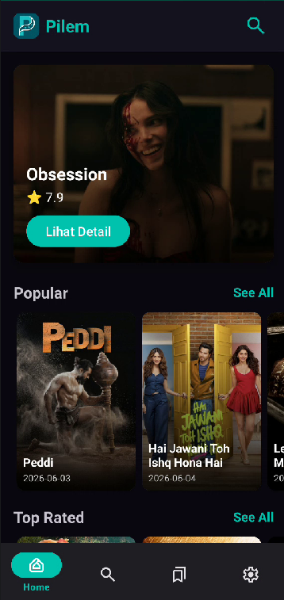
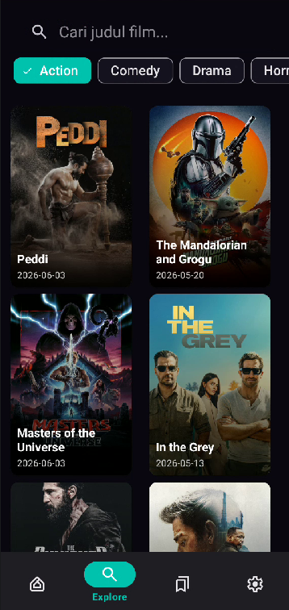
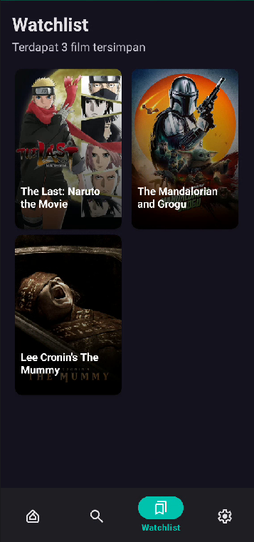

# Pilem - Aplikasi Informasi Film

**Pilem** adalah aplikasi Android berbasis Java yang dikembangkan sebagai Tugas Final Laboratorium Pemrograman Mobile. Aplikasi ini memungkinkan pengguna untuk menjelajahi daftar film populer, mencari film, dan menyimpan film favorit ke dalam penyimpanan lokal dengan dukungan multi-user.

## 📱 Fitur Utama
- **Autentikasi Pengguna:** Sistem Login dan Register untuk mengelola akun pengguna secara lokal.
- **Daftar Film Populer:** Menampilkan daftar film terbaru menggunakan RecyclerView.
- **Pencarian Film:** Memudahkan pengguna mencari film melalui fitur Explore.
- **Detail Film:** Informasi lengkap mengenai film yang dipilih (menggunakan Explicit Intent).
- **Watchlist (Multi-user):** Menyimpan daftar film favorit secara permanen menggunakan Room Database, terisolasi untuk setiap akun pengguna melalui `userId`.
- **Dark/Light Mode:** Mendukung tema gelap dan terang secara manual melalui menu pengaturan.
- **Manajemen Sesi:** Fitur Logout untuk keluar dari akun dan mengakhiri sesi pengguna.
- **Offline Resilience:** Penanganan kegagalan jaringan dengan fitur *Refresh*.

## 📸 Screenshots

|              Dashboard Utama              | Detail Film | Eksplorasi |                   Watchlists                    |
|:-----------------------------------------:| :---: | :---: |:-----------------------------------------------:|
|  |  |  |  |


## 🛠️ Tech Stack & Spesifikasi
- **Bahasa Pemrograman:** Java
- **Arsitektur & UI:**
  - Navigation Component (Fragment-based navigation).
  - Material Design 3 (M3).
  - RecyclerView dengan ListAdapter/Adapter.
- **Networking:** Retrofit dengan OkHttp Interceptor untuk manajemen API Key.
- **Local Database:** Room Database untuk penyimpanan data akun dan watchlist.
- **Session Management:** SharedPreferences untuk mengelola sesi login pengguna (`UserSession`).
- **Concurrency:** `ExecutorService` untuk operasi database di background thread.
- **Library Pihak Ketiga:**
  - Glide (Image Loading).
  - Gson (JSON Parsing).

## 🚀 Cara Instalasi & Penggunaan

### 1. Prasyarat
- **Android Studio** (Ladybug atau versi lebih baru direkomendasikan).
- **JDK 11** atau lebih tinggi.
- **API Key** dari [TMDB (The Movie Database)](https://www.themoviedb.org/documentation/api).

### 2. Clone Repositori
Langkah pertama adalah menyalin repositori ini ke komputer lokal Anda. Buka terminal atau command prompt, lalu jalankan perintah:
```bash
git clone https://github.com/Onlyadmirer/pilem.git
```

### 3. Buka Proyek di Android Studio
1. Jalankan **Android Studio**.
2. Pilih menu **File > Open**.
3. Navigasikan ke folder hasil clone tersebut (pilih folder `FINAL`).
4. Tunggu hingga proses **Gradle Sync** selesai secara otomatis oleh IDE.

### 4. Konfigurasi API Key
Aplikasi ini menggunakan sistem keamanan untuk melindungi API Key agar tidak terekspos secara publik.
1. Cari file `local.properties` di root project.
2. Tambahkan baris berikut di bagian paling bawah:
   ```properties
   TMDB_API_KEY=isi_api_key_anda_disini
   ```
3. Klik **Sync Project with Gradle Files** di toolbar Android Studio. API Key kini siap digunakan melalui `BuildConfig.TMDB_API_KEY`.

### 5. Build & Run
- Sambungkan perangkat Android fisik atau gunakan Emulator (Min SDK 29).
- Klik tombol **Run** (ikon segitiga hijau) di toolbar atas Android Studio untuk menjalankan aplikasi.

## 📦 Unduh APK

Anda dapat langsung mencoba aplikasi ini dengan mengunduh berkas APK yang tersedia:

1. Buka halaman [Releases Pilem](https://github.com/Onlyadmirer/pilem/releases).
2. Cari versi terbaru dan unduh file `Pilem.apk` pada bagian **Assets**.
3. Instal APK tersebut di perangkat Android Anda (pastikan izin instalasi dari sumber tidak dikenal telah diaktifkan).

## 📝 Implementasi Teknis Singkat

- **Manajemen Fragment & Navigasi:** Perpindahan antar layar (Auth, Home, Explore, Watchlist, Settings) dikelola oleh `NavHostFragment` melalui Navigation Graph. Sesi login dicek untuk menentukan layar pertama yang muncul.
- **Sistem Autentikasi:** Menggunakan Room Database untuk menyimpan kredensial pengguna dan `UserSession` (SharedPreferences) untuk menjaga status login.
- **Keamanan API:** Setiap request ke TMDB disisipkan API Key secara otomatis menggunakan `Interceptor` pada OkHttp Client.
- **Isolasi Data (Multi-user):** Data watchlist dikaitkan dengan `userId` unik di dalam database, sehingga setiap pengguna memiliki daftar favorit yang berbeda.
- **Operasi Database:** Semua operasi Room dijalankan secara asinkron menggunakan `ExecutorService` untuk menjaga kelancaran UI.

---
*Proyek ini dikembangkan untuk memenuhi tugas akhir praktikum Mobile Programming.*
